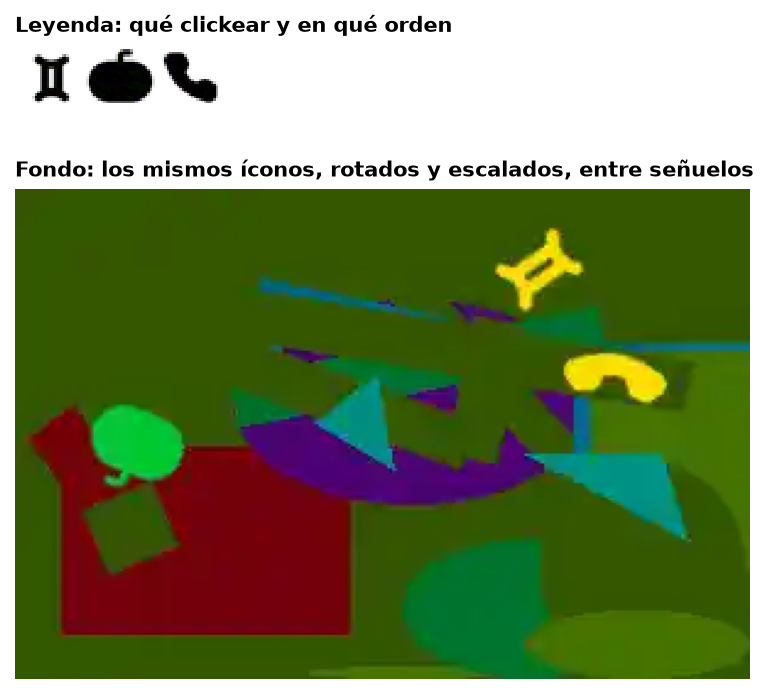
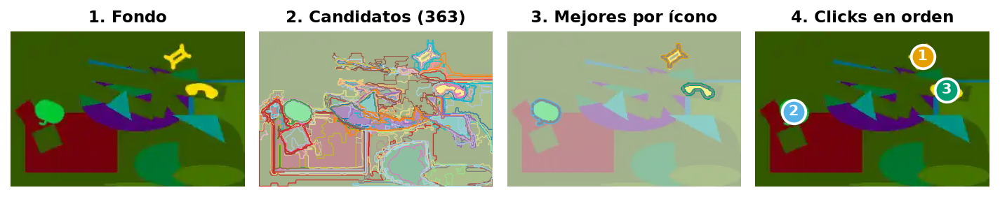
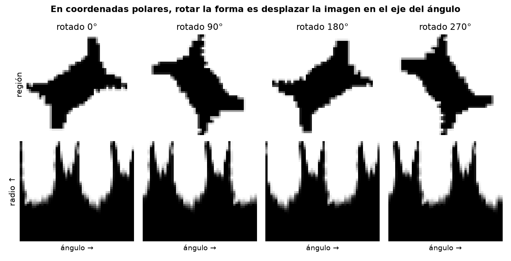
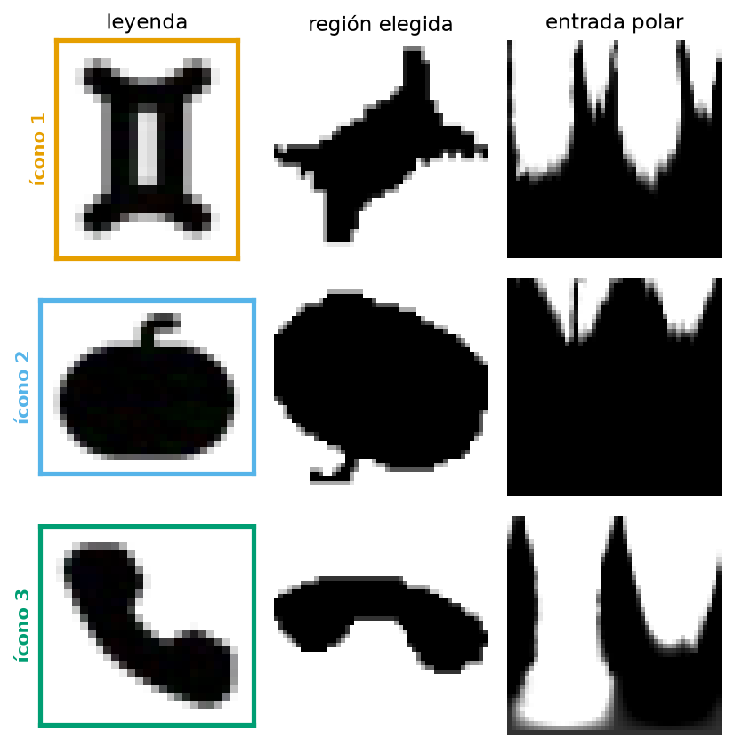
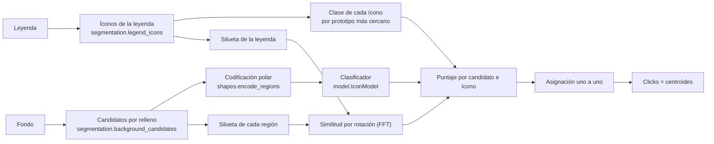
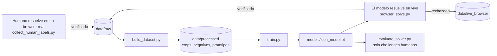

[English](README.md) | Español

# icon-captcha-solver

Un modelo chico, entrenado desde cero, que resuelve el captcha visual de íconos de **BotDeflector**: el paso visual que usa Queue-it (y sitios detrás de `dual.challenge.queue-it.net` / `botdeflector.eu`) para separar humanos de bots. El objetivo es mostrar con números que este diseño de captcha no es la barrera que parece.

El entregable es el modelo y este writeup, no una herramienta de scraping.

| | |
|---|---|
| Challenges resueltos (validación offline, todo o nada) | **93.7%** (59 de 63) |
| Íconos acertados | **97.9%** (185 de 189) |
| Prueba en vivo contra el sitio real, en un browser | **20 de 20** verificados |
| Tiempo por challenge (CPU) | ~0.26 s |
| Tamaño del clasificador | ~25 mil parámetros |

<p align="center"></p>

## El captcha

Cada challenge son dos imágenes:

- **Leyenda**: 2 o 3 íconos en fila, sin deformar. Se leen de izquierda a derecha, que es también el orden en que hay que clickearlos.
- **Fondo** (300×200): los mismos íconos, **rotados y escalados de forma uniforme** (nunca estirados ni deformados), rellenos de un color arbitrario, mezclados con formas geométricas, líneas señuelo y **otros íconos de la misma librería** que no son los pedidos.

La respuesta es un punto por ícono, en orden. El servidor la acepta si cada punto cae cerca del centro del ícono correcto.

Dos propiedades del servidor definen el problema, y ambas se confirmaron en vivo:

- **Cada challenge es de un solo uso y todo o nada.** Un intento equivocado consume el challenge sin decir qué punto falló: acertar 2 de 3 da el mismo error opaco que no acertar ninguno. No hay forma de usar el verificador como oráculo para probar combinaciones.
- **No alcanza con visión clásica.** Comparar el contorno limpio de la leyenda contra las formas del fondo con momentos de Hu (`cv2.matchShapes`), con asignación óptima y también sumando priors de tamaño y proporción, deja la respuesta correcta en el puesto 56, 163 o 37.356 del ranking según el challenge. Un señuelo casi siempre se parece más.

## Cómo funciona

<p align="center"></p>

1. **Candidatos.** El fondo se segmenta con un relleno de rango fijo (flood fill) sembrado en una grilla. El umbral se mide contra el color de la semilla, no contra el vecino: así el relleno no se escapa por gradientes suaves hacia formas de color parecido. Salen unas 460 regiones por fondo, y en el 99.5% de los íconos pedidos alguna de ellas es la correcta.
2. **Codificación.** Cada región pasa a una máscara de forma de 48×48 (sin estirar: se completa a cuadrado antes de reducir) y de ahí a **coordenadas polares** centradas en su centroide. El color no se usa: es aleatorio y no aporta información.
3. **Clasificación.** Una CNN chica asigna cada región a uno de los **20 íconos** de la librería o a una clase **fondo**. La librería resultó chica y estable, así que es un problema de clasificación de conjunto cerrado, no de comparar embeddings.
4. **Silueta de la leyenda.** Como segunda señal, que no depende de lo aprendido, cada región se compara contra la silueta exacta del ícono pedido, sacada de la propia leyenda: un IoU suave maximizado sobre todas las rotaciones, calculado de una vez con una FFT del eje angular.
5. **Asignación.** El puntaje es `log p(clase) + log(similitud)`. La asignación uno a uno que maximiza el puntaje conjunto se busca por fuerza bruta entre los 8 mejores candidatos de cada ícono, descartando dos candidatos que en realidad son el mismo ícono.
6. **Click.** El centroide de la región, aunque caiga fuera del trazo (el teléfono, Leo): es lo que el servidor valida y lo que hace un humano.

### La idea clave: rotación en coordenadas polares

<p align="center"></p>

Los íconos del fondo aparecen en cualquier ángulo. En coordenadas polares, rotar una forma es **desplazar la imagen de forma circular en el eje del ángulo**. La red usa padding circular en ese eje y pooling global al final, así que es invariante a la rotación por construcción y no tiene que aprenderlo de los ejemplos. Con pocos cientos de challenges etiquetados, eso marcó la diferencia: pasar de la representación cartesiana a la polar subió la precisión del clasificador de 31.6% a 39.7% con la segmentación de ese momento.

<p align="center"></p>

## Arquitectura



El invariante que ordena el diseño: **el entrenamiento y la inferencia ven el mismo dominio.** La región verdadera bajo un click humano (entrenamiento) y los candidatos del fondo (inferencia) salen del mismo relleno con la misma configuración, y toda forma llega al modelo por la misma codificación. Si la segmentación de entrenamiento y la de inferencia difieren, la precisión offline deja de predecir lo que pasa al resolver.

### Datos y etiquetado



Como el verificador es de un solo uso, las etiquetas no se pueden generar probando. Se cosechan de resoluciones que el servidor aceptó:

- **Humanas**: un Chromium visible registra los clicks del `/icon/verify` aceptado y las imágenes de ese mismo challenge.
- **Del modelo**: una vez entrenado, el modelo resuelve challenges en vivo y guarda los que el servidor verifica. Esos van **siempre a entrenamiento**: solo existen porque el modelo acertó, y en validación la llenarían de casos fáciles.

Además de los crops de íconos, cada challenge etiquetado aporta **negativos gratis**. Toda región que no toca un ícono marcado es, con seguridad, ninguno de los pedidos. El modelo aprende de ellos con una pérdida que solo afirma eso, `-log(1 - Σ p(pedidas))`, sin inventar a qué clase pertenecen.

Dataset actual: 327 challenges (304 etiquetados por humanos y 23 por el modelo), 979 crops de íconos y 9.810 negativos. La validación son 63 challenges humanos, elegidos por hash del id.

## Resultados

La métrica que decide es la tasa de challenges resueltos de punta a punta sobre la validación, todo o nada, como `/icon/verify`. Un punto cuenta como acierto si cae a 8 px o menos del click humano aceptado o del centro de la región verdadera; es una estimación conservadora a partir de los clicks humanos que el servidor aceptó.

| Paso | Resueltos |
|---|---|
| Primer solver completo: candidatos por relleno, clasificador y negativos | 47.0% |
| Leyenda del candado bien separada; se guarda el último epoch | 59.6% |
| Silueta de la leyenda como segunda señal | 74.3% |
| Click siempre en el centroide (y criterio de acierto estricto) | 85.8% |
| Librería real de 20 íconos (antes eran 15 clases mezcladas) | 90.7% |
| **Modelo desplegado** | **93.7%** |

Salvo el modelo desplegado, que fue la mejor de sus 3 corridas originales, cada fila es la media de al menos 3 corridas: con unos 60 challenges de validación, el ruido entre corridas es de ±3 a 5 puntos. Desde el cuarto paso el criterio de acierto es más estricto que en los anteriores. Reentrenar con el código actual da 90.2% de media (88.5 a 91.8%). En vivo, el modelo resolvió 20 challenges seguidos contra el sitio real, en dos sesiones.

Lo que se probó y no funcionó, con sus números, está en [`docs/research.md`](docs/research.md): crops sintéticos (cuatro variantes, todas peores), balanceo de clases, promediar rotaciones al inferir, segmentación por color cuantizado y filtrar crops por parecido con la leyenda.

## Uso

### Instalación

```bash
python -m venv .venv
.venv\Scripts\activate          # Windows
source .venv/bin/activate       # Linux / macOS
pip install -r requirements-dev.txt
pip install torch               # o, con GPU: pip install torch --index-url https://download.pytorch.org/whl/cu126
playwright install chromium     # solo para los scripts que usan el browser
```

`requirements.txt` tiene las dependencias de ejecución; `requirements-dev.txt` suma pytest, ruff, mypy y matplotlib (para las figuras). `torch` se instala aparte porque la wheel correcta depende del hardware.

El dataset (`data/`) y el modelo entrenado (`models/`) no se versionan. Los scripts de abajo los generan.

### Resolver un challenge

```python
from icon_solver.solver import solve_icon

points = solve_icon(background_bytes, legend_bytes)
# [{"x": 214, "y": 32}, {"x": 49, "y": 103}, {"x": 245, "y": 75}], en el orden de la leyenda
```

Necesita `src/` en el `sys.path` y `models/icon_model.pt`. La firma es la del proyecto que lo consume, para poder reemplazarlo cambiando un solo archivo.

### Scripts

| Script | Para qué |
|---|---|
| `collect_human_labels.py --count N` | Abre un browser; cada challenge que resolvés y el servidor acepta queda etiquetado en `data/raw/`. |
| `browser_solve.py --count N` | El modelo resuelve challenges en vivo. Los verificados van a `data/raw/` como etiquetados por el modelo, los rechazados a `data/live_browser/`, y cada intento queda en `attempts.jsonl`. |
| `collect_dataset.py --count N` | Etiquetador automático por HTTP con el ranking de Hu-moments. Se conserva como referencia: su rendimiento medido es 0 de 5. |
| `build_dataset.py` | `data/raw/` → `data/processed/`: crops, negativos, prototipos de leyenda y manifest. |
| `train.py [--out ruta] [--seed N]` | Entrena y guarda el modelo (por defecto en `models/icon_model.pt`). Unos 4 minutos en una GPU de escritorio. |
| `evaluate_solver.py` | La métrica principal: resueltos, íconos y recall de candidatos sobre la validación. |
| `evaluate.py` | Diagnóstico del clasificador: precisión y matriz de confusión. |
| `audit_crops.py` | Compara cada crop con la silueta de su ícono para encontrar fallas de segmentación. |

Todos corren desde la raíz del repo (`python scripts/<script>.py`) y aceptan `--help`. Las figuras de este README se regeneran con `python docs/make_figures.py`.

### Tests

```bash
pytest                      # todo, ~3 minutos en CPU
pytest -m "not slow"        # sin el build completo ni las métricas de punta a punta
ruff check src scripts tests
mypy
```

`tests/unit/` corre siempre. `tests/characterization/` compara el pipeline completo contra una referencia capturada (clicks de cada challenge, candidatos, codificación, build del dataset y métricas), y se saltea si faltan los datos locales o el modelo entrenado.

## Estructura

```
src/icon_solver/
  segmentation.py   regiones del fondo y de la leyenda (una sola configuración)
  shapes.py         codificación de forma: crop, polar, siluetas y su similitud
  legend.py         prototipos de leyenda y clase de cada ícono
  model.py          clasificador polar y el artefacto IconModel
  solver.py         solver, traza de cada resolución y solve_icon
  evaluation.py     métricas del solver y del clasificador
  training.py       entrenamiento
  challenges.py     tipo Challenge, almacén en disco y regla de validación
  paths.py          rutas del proyecto
  dataset/          build del dataset, dataset de PyTorch, auditoría
  collection/       protocolo HTTP, proof-of-work, sesión de browser, etiquetador legacy
scripts/            un envoltorio fino por tarea
tests/              unitarios y de caracterización
docs/               registro de investigación, ADRs y figuras
```

## Documentación

- [`docs/research.md`](docs/research.md): cada experimento descartado, con qué se probó, el número medido, por qué se descartó y cómo reproducirlo.
- [`docs/adr/`](docs/adr): las decisiones de diseño con su porqué (clasificación de conjunto cerrado, mismo relleno para entrenamiento e inferencia, validación solo humana, síntesis descartada).
- [`CONTEXT.md`](CONTEXT.md): el glosario del dominio.

## Alcance y ética

Investigación de seguridad sobre un producto anti-bot de terceros, hecha para publicar un hallazgo, no para ofrecer un servicio de bypass. El volumen de requests contra la infraestructura del vendor se mantuvo en lo necesario para la investigación: cientos de challenges en total, casi todos resueltos a mano. El alcance es este captcha puntual; no se extiende a otros tipos de challenge (Cloudflare, hCaptcha, etc.).
