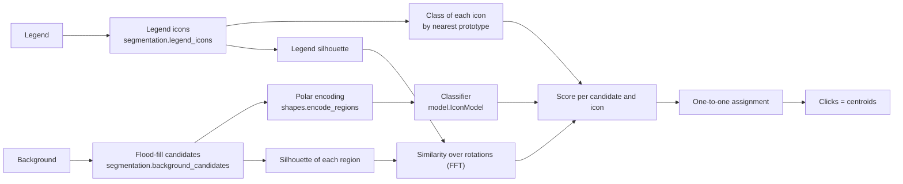
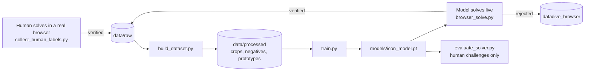

English | [Español](README.es.md)

# icon-captcha-solver

A small model, trained from scratch, that solves **BotDeflector**'s visual icon captcha: the visual step Queue-it (and sites behind `dual.challenge.queue-it.net` / `botdeflector.eu`) uses to tell humans from bots. The goal is to show, with numbers, that this captcha design is not the barrier it appears to be.

The deliverable is the model and this writeup, not a scraping tool.

| | |
|---|---|
| Challenges solved (offline validation, all-or-nothing) | **93.7%** (59 of 63) |
| Icons correct | **97.9%** (185 of 189) |
| Live test against the real site, in a browser | **20 of 20** verified |
| Time per challenge (CPU) | ~0.26 s |
| Classifier size | ~25K parameters |

<p align="center"></p>

## The captcha

Each challenge consists of two images:

- **Legend**: 2 or 3 icons in a row, undistorted. They are read left to right, which is also the order in which they must be clicked.
- **Background** (300×200): the same icons, **rotated and uniformly scaled** (never stretched or warped), filled with an arbitrary color, mixed in with geometric shapes, decoy lines and **other icons from the same library** that were not asked for.

The answer is one point per icon, in order. The server accepts it if each point lands near the center of the correct icon.

Two properties of the server define the problem, and both were confirmed live:

- **Each challenge is single-use and all-or-nothing.** A wrong attempt consumes the challenge without saying which point failed: getting 2 of 3 right returns the same opaque error as getting none right. There is no way to use the verifier as an oracle to test combinations.
- **Classical computer vision is not enough.** Comparing the clean legend contour against the background shapes with Hu moments (`cv2.matchShapes`), with optimal assignment and also with added size and aspect-ratio priors, puts the correct answer at rank 56, 163 or 37,356 depending on the challenge. A decoy almost always looks more similar.

## How it works

<p align="center"></p>

1. **Candidates.** The background is segmented with a fixed-range flood fill seeded on a grid. The threshold is measured against the seed color, not the neighboring pixel, so the fill does not leak through smooth gradients into similarly colored shapes. This yields about 460 regions per background, and for 99.5% of the requested icons one of them is the correct one.
2. **Encoding.** Each region becomes a 48×48 shape mask (without stretching: it is padded to a square before downscaling) and then goes to **polar coordinates** centered on its centroid. Color is not used: it is random and carries no information.
3. **Classification.** A small CNN assigns each region to one of the library's **20 icons** or to a **background** class. The library turned out to be small and stable, so this is a closed-set classification problem, not an embedding comparison one.
4. **Legend silhouette.** As a second signal, independent of anything learned, each region is compared against the exact silhouette of the requested icon, taken from the legend itself: a soft IoU maximized over all rotations, computed in one pass with an FFT over the angular axis.
5. **Assignment.** The score is `log p(class) + log(similarity)`. The one-to-one assignment that maximizes the joint score is found by brute force among the top 8 candidates for each icon, discarding pairs of candidates that are actually the same icon.
6. **Click.** The region's centroid, even when it falls outside the stroke (the phone, Leo): that is what the server validates and what a human does.

### The key idea: rotation in polar coordinates

<p align="center"></p>

Icons in the background appear at any angle. In polar coordinates, rotating a shape is **a circular shift of the image along the angle axis**. The network uses circular padding on that axis and global pooling at the end, so it is rotation-invariant by construction and does not have to learn it from examples. With only a few hundred labeled challenges, that made the difference: switching from the Cartesian to the polar representation raised classifier accuracy from 31.6% to 39.7% with the segmentation of the time.

<p align="center"></p>

## Architecture



The invariant that drives the design: **training and inference see the same domain.** The true region under a human click (training) and the background candidates (inference) come from the same flood fill with the same configuration, and every shape reaches the model through the same encoding. If training and inference segmentation differ, offline accuracy stops predicting what happens when solving.

### Data and labeling



Since the verifier is single-use, labels cannot be generated by trial and error. They are harvested from solutions the server accepted:

- **Human**: a visible Chromium records the clicks from the accepted `/icon/verify` and the images of that same challenge.
- **Model**: once trained, the model solves challenges live and keeps the ones the server verifies. These **always go to training**: they only exist because the model got them right, and in validation they would fill it with easy cases.

Besides the icon crops, each labeled challenge provides **free negatives**. Any region that does not touch a marked icon is, with certainty, none of the requested ones. The model learns from them with a loss that asserts only that, `-log(1 - Σ p(requested))`, without making up which class they belong to.

Current dataset: 327 challenges (304 labeled by humans and 23 by the model), 979 icon crops and 9,810 negatives. Validation is 63 human challenges, selected by a hash of the id.

## Results

The deciding metric is the end-to-end solve rate over validation, all-or-nothing, like `/icon/verify`. A point counts as a hit if it lands within 8 px of the accepted human click or of the center of the true region; this is a conservative estimate based on the human clicks the server accepted.

| Step | Solved |
|---|---|
| First complete solver: flood-fill candidates, classifier and negatives | 47.0% |
| Padlock legend split correctly; last epoch is kept | 59.6% |
| Legend silhouette as a second signal | 74.3% |
| Click always on the centroid (and strict hit criterion) | 85.8% |
| Real 20-icon library (previously 15 mixed classes) | 90.7% |
| **Deployed model** | **93.7%** |

Except for the deployed model, which was the best of its 3 original runs, each row is the mean of at least 3 runs: with about 60 validation challenges, run-to-run noise is ±3 to 5 points. From the fourth step on, the hit criterion is stricter than in the earlier ones. Retraining with the current code gives a 90.2% mean (88.5 to 91.8%). Live, the model solved 20 challenges in a row against the real site, over two sessions.

What was tried and did not work, with its numbers, is in [`docs/research.md`](docs/research.md): synthetic crops (four variants, all worse), class balancing, averaging over rotations at inference, color-quantized segmentation and filtering crops by similarity to the legend.

## Usage

### Installation

```bash
python -m venv .venv
.venv\Scripts\activate          # Windows
source .venv/bin/activate       # Linux / macOS
pip install -r requirements-dev.txt
pip install torch               # or, with a GPU: pip install torch --index-url https://download.pytorch.org/whl/cu126
playwright install chromium     # only for the scripts that use the browser
```

`requirements.txt` has the runtime dependencies; `requirements-dev.txt` adds pytest, ruff, mypy and matplotlib (for the figures). `torch` is installed separately because the right wheel depends on the hardware.

The dataset (`data/`) and the trained model (`models/`) are not version-controlled. The scripts below generate them.

### Solving a challenge

```python
from icon_solver.solver import solve_icon

points = solve_icon(background_bytes, legend_bytes)
# [{"x": 214, "y": 32}, {"x": 49, "y": 103}, {"x": 245, "y": 75}], in legend order
```

It needs `src/` on `sys.path` and `models/icon_model.pt`. The signature matches the project that consumes it, so it can be swapped in by changing a single file.

### Scripts

| Script | Purpose |
|---|---|
| `collect_human_labels.py --count N` | Opens a browser; every challenge you solve that the server accepts is saved, labeled, to `data/raw/`. |
| `browser_solve.py --count N` | The model solves challenges live. Verified ones go to `data/raw/` as model-labeled, rejected ones to `data/live_browser/`, and every attempt is logged in `attempts.jsonl`. |
| `collect_dataset.py --count N` | Automatic HTTP labeler using the Hu-moments ranking. Kept for reference: its measured yield is 0 of 5. |
| `build_dataset.py` | `data/raw/` → `data/processed/`: crops, negatives, legend prototypes and manifest. |
| `train.py [--out path] [--seed N]` | Trains and saves the model (by default to `models/icon_model.pt`). About 4 minutes on a desktop GPU. |
| `evaluate_solver.py` | The main metric: solved challenges, icons and candidate recall over validation. |
| `evaluate.py` | Classifier diagnostics: accuracy and confusion matrix. |
| `audit_crops.py` | Compares each crop with its icon's silhouette to find segmentation failures. |

All of them run from the repo root (`python scripts/<script>.py`) and accept `--help`. The figures in this README are regenerated with `python docs/make_figures.py`.

### Tests

```bash
pytest                      # everything, ~3 minutes on CPU
pytest -m "not slow"        # without the full build or the end-to-end metrics
ruff check src scripts tests
mypy
```

`tests/unit/` always runs. `tests/characterization/` compares the full pipeline against a captured reference (clicks for each challenge, candidates, encoding, dataset build and metrics), and is skipped if the local data or the trained model are missing.

## Project structure

```
src/icon_solver/
  segmentation.py   background and legend regions (a single configuration)
  shapes.py         shape encoding: crop, polar, silhouettes and their similarity
  legend.py         legend prototypes and the class of each icon
  model.py          polar classifier and the IconModel artifact
  solver.py         solver, trace of each solve and solve_icon
  evaluation.py     solver and classifier metrics
  training.py       training
  challenges.py     Challenge type, on-disk store and validation rule
  paths.py          project paths
  dataset/          dataset build, PyTorch dataset, audit
  collection/       HTTP protocol, proof-of-work, browser session, legacy labeler
scripts/            one thin wrapper per task
tests/              unit and characterization tests
docs/               research log, ADRs and figures
```

## Documentation

- [`docs/research.md`](docs/research.md): every discarded experiment, what was tried, the measured number, why it was discarded and how to reproduce it.
- [`docs/adr/`](docs/adr): the design decisions and their rationale (closed-set classification, same flood fill for training and inference, human-only validation, synthesis discarded).
- [`CONTEXT.md`](CONTEXT.md): the domain glossary.

## Scope and ethics

Security research on a third-party anti-bot product, done to publish a finding, not to offer a bypass service. Request volume against the vendor's infrastructure was kept to what the research required: hundreds of challenges in total, almost all of them solved by hand. The scope is this specific captcha; it does not extend to other challenge types (Cloudflare, hCaptcha, etc.).
